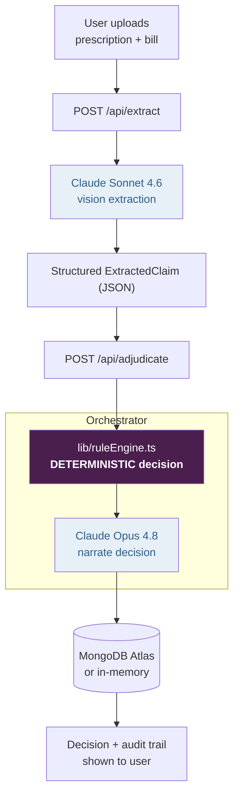
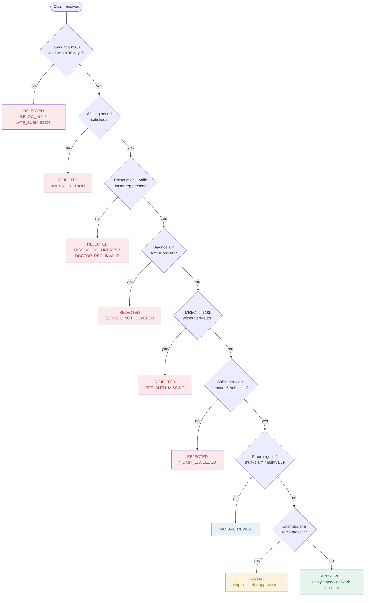

# Architecture & Decision Logic

## System data flow

The two AI calls (blue) only ever touch words and images. The decision node
(purple) is plain TypeScript. Money flows through the purple box only.

## Adjudication decision logic

## Priority rules (when checks conflict)

Per `adjudication_rules.md`, evaluated top-down:

1. Safety first — fraud patterns → `MANUAL_REVIEW`
2. Policy exclusions override everything → `REJECTED`
3. Hard limits cannot be exceeded → `REJECTED` / capped
4. Medical necessity is mandatory
5. When in doubt → `MANUAL_REVIEW`
